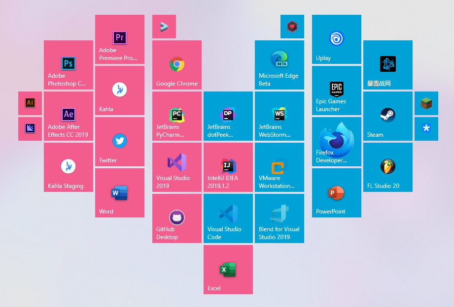

---

## DEPRECATED  

MS在20H2 07更新(KB4565503)中更改了磁贴颜色计算方式(就是全部遵循主题色), 颜色自定义不再可用.  
图标自定义仍可继续使用  
本项目暂停维护<del>(咕)</del>   

---

# Saber's Color Startmenu
# 开始菜单磁贴自定义工具

## [反馈（或点击Issues） Feedback](https://github.com/hv0905/SaberColorfulStartmenu/issues)
## [主页 Homepage](https://edgeneko.github.io/2019/01/31/SaberColorfulStartmenu/)

### 感谢支持^_^  Thanks for your Support ^_^

### 嗯，这个工具可以更改你的开始菜单应用磁贴的颜色，图标等。

### This tool can change the app's logo and background color in your Win10 startmenu.

### 应用下载 App Download:

[Github Release下载 Download from Github Release](https://github.com/hv0905/SaberColorfulStartmenu/releases)  
[你也可以从ci下载最新的非正式发布版本](https://ci.appveyor.com/project/hv0905/sabercolorfulstartmenu/build/artifacts)  
[you can download the newest developing version from our CI.](https://ci.appveyor.com/project/hv0905/sabercolorfulstartmenu/build/artifacts)  

### 关于 About:
> Saber's Colorful Startmenu Version:2.4.1 (release 2.4.1)
> 
> 作者：HV0905
> 
> 仅支持Win10操作系统
> 
> 本程序可以通过修改快捷方式文件下的visualelementsmanifest.xml对开始菜单图标进行定制
> 
> 本程序部分图标取自 Windows 9 Icons 作者: dtafalonso
> 参考: dtafalonso.deviantart.com/art/Windows-9-icons-359505915
> 
> 背景：pixiv #66754493
> 
> 基于C# WPF .Net Framework 4.6.2 使用Visual Studio 2019 Community编译
> 
> 本程序遵循MIT协议开放源代码, 如需下载源代码，请前往Github页面。

# 截图 Snapshots：

# 支持 Support

开发不易,请作者喝瓶肥宅快乐水吧.

Support us!(●'◡'●)

|支付宝|微信|
|:-----:|:-----:|
|||
